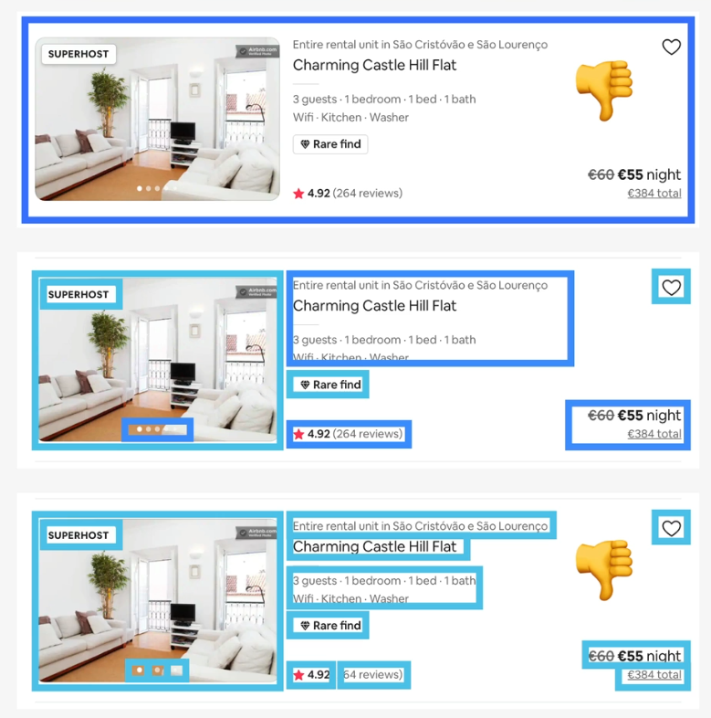
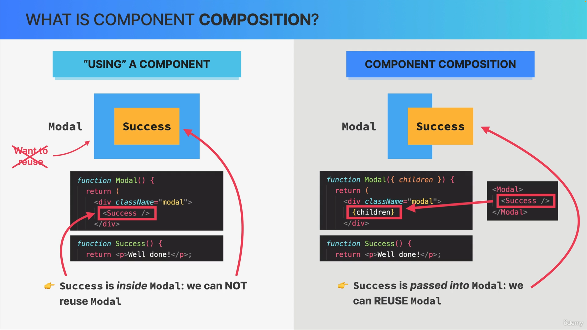

# Use pop corn

A movie tracker

# Component size **matters**

Bij het maken van compenten is het belangrijk dat het te groot en niet te klein is. Wanneer een component te veel taken heeft wordt het onoverzichtelijk. Dat component heeft teveel verantwoordelijkheden.

Alle manieren om te zien of een component te groot is:

- Teveel verantwoordelijkheden (responsibilities)
- Teveel variabelen mee krijgen (props)
- Moeilijk te (her)gebruiken
- Complexe/teveel code, en dus moeilijk te begrijpen

Alle manieren om te zien of een component te klein is:

- Wanneer er teveel componenten zijn, en dus teveel bestanden
- Component verbergt teveel wat het doet. Een knop waarvan je niet meer kunt zien wat de code doet.

Het is dus belangrijk om te zoeken naar de juiste balans. Hieronder staat een voorbeeld van hoe je het kunt aanpakken.

De 4 kritea voor het splitten van een component zijn:

1. Logica in verdeling van de layout
   - Hebben de layouts met elkaar te maken?
2. Herbruikbaarheid
   - Is het mogelijk om het vaker te gebruiken?
3. Verantwoordelijkheid en nivea van complexiteit
   - Is het afhankelijk van teveel andere?
   - Heeft het teveel props?
   - Heeft het teveel UseStates?
   - Is het te ingewikkeld qua JSX?
4. persoonlijke coding style
   - Voelt het fijn om op deze manier te werken?
   - Kun je code gemakkelijk terug vinden?

# Component categories

| State*less*               | State*full*    | Structural                   |
| ------------------------- | -------------- | ---------------------------- |
| No state                  | Have state     | Pages, layouts, screens      |
| Can receive props or data | Still reusable | Results of compositions      |
| Small and reusable        |                | Can be huge and non-reusable |

# Prop drilling

Wanneer je een prop op meerder plekken nodig hebt in je app kan er `prop drilling` onstaan. Dit is het doorgeven van props terwijl andere components die informatie helemaal niet nodig hebben.

## Oplossing

Een manier om dit te voorkomen heet component composition. Hier maak je gebruikt van een lege component die je met een andere component vult. Het voordeel hiervan is dat je de state niet door verschillende lagen heen hoeft te "drillen". Je kunt de prop meegeven aan een andere component die je als invulling toepast.

